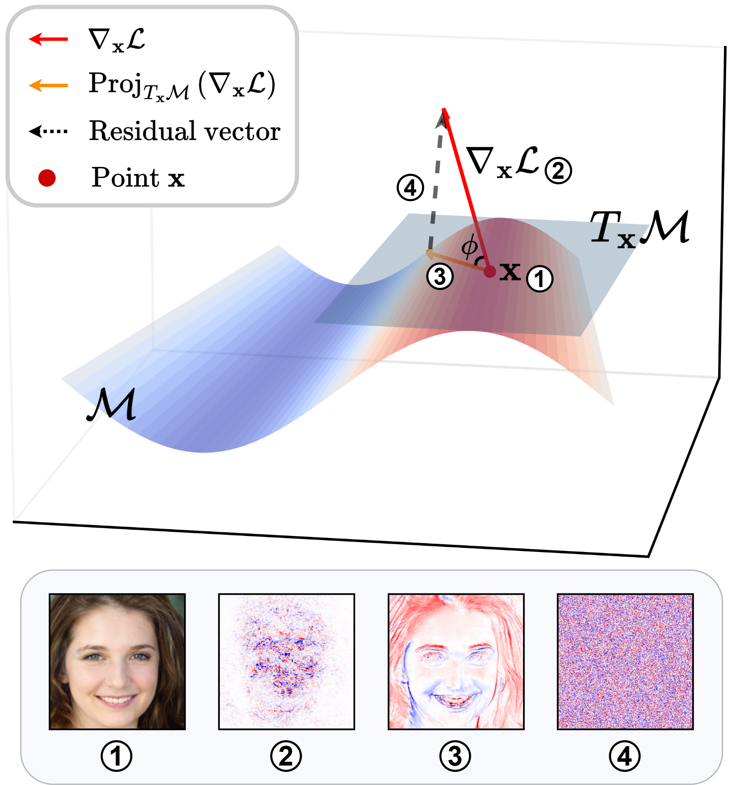

<h1 align="center">Generative Model Inversion Through the Lens of the Manifold Hypothesis</h1>
<p align="center">
    <a href="https://neurips.cc/virtual/2025/poster/117375" style="text-decoration:none;">
        
    </a>
    <a href="https://arxiv.org/pdf/2509.20177" style="text-decoration:none;">
        
    </a>
</p>

Hi, this is the code for our NeurIPS 2025 paper: *[Generative Model Inversion Through the Lens of the Manifold Hypothesis](https://arxiv.org/pdf/2509.20177)*.


---

<table style="width:100%; table-layout:fixed; border-collapse:collapse;">
  <colgroup>
    <col style="width:20%;">
    <col style="width:80%;">
  </colgroup>
  <tr>
    <td style="vertical-align:middle; padding-right:16px;">
      <p style="margin:0; word-break:break-word;">
        <strong>Geometric interpretation of loss gradients projection onto the generator manifold.</strong>
        The generative model inversion process implicitly denoises the loss gradients by projecting them onto the tangent space of the generator manifold. The bottom panel illustrates the reconstructed image, its inversion-time loss gradients, the manifold-projected gradients, and the residual component.
      </p>
    </td>
    <td style="text-align:right;">
      
    </td>
  </tr>
</table>


# 🚀 Getting started

## 1. Environment Setup

Install all required dependencies using the provided environment file:

```bash
conda env create -f AlignMI.yaml
conda activate AlignMI
```

## 2.1 High-resolution setup
### 🧩 Setup StyleGAN2
For using our attacks with StyleGAN2, clone the official [StyleGAN2-ADA-Pytorch](https://github.com/NVlabs/stylegan2-ada-pytorch) repo into the project's root folder and remove its git specific folders and files. 
```
git clone https://github.com/NVlabs/stylegan2-ada-pytorch.git
rm -r --force stylegan2-ada-pytorch/.git/
rm -r --force stylegan2-ada-pytorch/.github/
rm --force stylegan2-ada-pytorch/.gitignore
```

To download the pre-trained weights, run the following command from the project's root folder or copy the weights into ```stylegan2-ada-pytorch```:
```bash
wget https://nvlabs-fi-cdn.nvidia.com/stylegan2-ada-pytorch/pretrained/ffhq.pkl -P stylegan2-ada-pytorch/
```
NVIDIA provides the following pre-trained models: ```ffhq.pkl, metfaces.pkl, afhqcat.pkl, afhqdog.pkl, afhqwild.pkl, cifar10.pkl, brecahad.pkl```. Adjust the command above accordingly. For the training and resolution details, please visit the official repo.

---

### 🗂️ Prepare Datasets
In this repository, we support [CelebA](https://mmlab.ie.cuhk.edu.hk/projects/CelebA.html) as datasets to train the target models. Please follow the instructions on the websites to download the datasets. Place all datasets in the folder ```data``` and make sure that the following structure is kept:

    .
    └── data       
        └── celeba
            ├── img_align_celeba
            ├── identity_CelebA.txt
            ├── list_attr_celeba.txt
            ├── list_bbox_celeba.txt
            ├── list_eval_partition.txt
            ├── list_landmarks_align_celeba.txt
            └── list_landmarks_celeba.txt

For CelebA, we used a custom crop of the images using the [HD CelebA Cropper](https://github.com/LynnHo/HD-CelebA-Cropper) to increase the resolution of the cropped and aligned samples. We cropped the images using a face factor of 0.65 and resized them to size 224x224 with bicubic interpolation. The other parameters were left at default. Note that we only use the 1,000 identities with the most number of samples out of 10,177 available identities. 

---

### 💾 Prepare Checkpoints for Target and Evaluation Models
Visit the shared Google Drive folder: 👉[Pretrained models](https://drive.google.com/drive/folders/1fPSoQrMzwohgkqdLJ9EwdEkgfTtft2rV?usp=sharing).


## 2.2 Low-resolution setup
### 🗂️ Prepare Datasets
In this repository, we support [CelebA](https://mmlab.ie.cuhk.edu.hk/projects/CelebA.html) and [FFHQ](https://drive.google.com/drive/folders/1tg-Ur7d4vk1T8Bn0pPpUSQPxlPGBlGfv) as datasets to train the target models. Please follow the instructions on the websites to download the datasets. Place all datasets in the ```data``` folder, maintaining the following directory structure. For datasets used in PLG-MI, please refer [PLG-MI Repository](https://github.com/LetheSec/PLG-MI-Attack).

    .
    └── data       
        ├── celeba
        │   ├── img_align_celeba
        │   └── meta
        │       ├── celeba_target_300ids_label.npy
        │       ├── celeba_target_300ids.npy
        │       ├── fea_target_300ids.npy
        │       ├── ganset.txt
        │       ├── testset.txt
        │       └── trainset.txt
        │
        │
        └── ffhq
            ├── thumbnails128x128
            └── meta
                └── ganset_ffhq.txt

---

### 💾 Prepare Checkpoints for Target and Evaluation Models
Visit the shared Google Drive folder: 👉[Pretrained models](https://drive.google.com/drive/folders/1fPSoQrMzwohgkqdLJ9EwdEkgfTtft2rV?usp=sharing).


# 🔍 Empirical Validation of the Hypothesis
## Tangent-Space Basis Computation

This step encodes input images using a pretrained VAE and computes the tangent-space basis of the data manifold via JVP + SVD. The results are saved as `(x, y, U)` tuples for downstream analysis.

## ▶️ Usage

**Single-process (rank 0 of 1):**
```bash
python compute_tangent_space_basis.py \
  --config ./configs/training/targets/compute_tangent_space_basis.yaml \
  --output_dir ./tangent_space \
  --batch_size 100 \
  --chunk_size 8 \
  --world_size 1 \
  --rank 0
```

**Multi-GPU example:**
```bash
for RANK in $(seq 0 $((WORLD_SIZE-1))); do
  CUDA_VISIBLE_DEVICES=$RANK python compute_tangent_space_basis.py \
    --config ./configs/training/targets/compute_tangent_space_basis.yaml \
    --output_dir ./tangent_space \
    --batch_size 100 \
    --chunk_size 8 \
    --world_size 10 \
    --rank $RANK &
done

```


## 🧩 Training the Alignment-Aware Model

Assuming your tangent-space files (e.g., `x_y_U_list_subset0.pt`) are ready, launch the alignment-aware training with:

```bash
python train_align_model.py \
  --config ./configs/training/targets/vgg16_align_train.yaml
```


# 🔍 Evaluation of Gradient–Manifold Alignment (AlignMI)

## 1. High-resolution Setting (based on Plug & Play Attack)
### Configuration Parameters:
Configuration files:
  - `./high_resolution/config/attacking/*.json` for hyperparameters such as training epochs, batch_size, optimizer, etc.
  - `./high_resolution/attacks/optimize.py` for PAA/TAA parameters and visualization settings. 

### 📦 Code script:
#### ➡️ Baseline (Standard PPA)
```bash
CUDA_VISIBLE_DEVICES=0  python -W ignore attack.py -c=./configs/attacking/CelebA_ResNet18_SG1024_bs50.yaml --exp_name=CelebA-ResNet18-id0-100;
```

#### ➡️ PAA (Perturbation-Averaged Alignment)
```bash
CUDA_VISIBLE_DEVICES=0  python -W ignore attack_PAA.py -c=./configs/attacking/CelebA_ResNet18_SG1024_bs50.yaml --exp_name=CelebA-ResNet18-PAA-id0-100
```

#### ➡️ TAA (Transformation-Averaged Alignment)
```bash
CUDA_VISIBLE_DEVICES=0  python -W ignore attack_TAA.py -c=./configs/attacking/CelebA_ResNet18_SG1024_bs50.yaml --exp_name=CelebA-ResNet18-TAA-id0-100
```


## 2. Low-resolution Setting
### Configuration Parameters:
Modify the configuration in 
  - `./low_resolution/config/attacking/*.json` for hyperparameters such as training epochs, batch_size, optimizer, etc.
  - `./low_resolution/attacks/optimize.py` for PAA/TAA parameters and visualization settings.

### 📦 Code script: LOMMA (GMI) as an example:
#### ➡️ Baseline (Standard GMI)
```bash
CUDA_VISIBLE_DEVICES=0 python attack_gmi.py -sg \
  --exp_name celeba_vgg16_gmi_id0-100 \
  --config configs/attacking/gmi_stylegan-celeba_vgg16-celeba.yaml
```

#### ➡️ PAA (Perturbation-Averaged Alignment)
```bash
CUDA_VISIBLE_DEVICES=0 python attack_gmi.py -sg \
  --exp_name celeba_vgg16_gmi_id0-100 \
  --config configs/attacking/gmi_stylegan-celeba_vgg16-celeba.yaml
```

#### ➡️ TAA (Transformation-Averaged Alignment)
```bash
CUDA_VISIBLE_DEVICES=0 python attack_gmi.py -sg \
  --exp_name celeba_vgg16_gmi_id0-100 \
  --config configs/attacking/gmi_stylegan-celeba_vgg16-celeba.yaml
```


# 📚 References
If you find this code helpful in your research, please consider citing
```bibtex
@inproceedings{peng2025AlignMI,
title={Generative Model Inversion Through the Lens of the Manifold Hypothesis},
author={Peng, Xiong and Han, Bo and Yu, Fengfei and Liu, Tongliang and Liu, Feng and Zhou, Mingyuan},
booktitle={NeurIPS},
year={2025}
}
```


# 😊 Implementation Credits
Our implementation benefits from several existing repositories. Thanks to the authors ([PPA](https://github.com/LukasStruppek/Plug-and-Play-Attacks), [GMI](https://github.com/AI-secure/GMI-Attack), [KEDMI](https://github.com/SCccc21/Knowledge-Enriched-DMI), [LOMMA](https://github.com/sutd-visual-computing-group/Re-thinking_MI), [BREPMI](https://github.com/m-kahla/Label-Only-Model-Inversion-Attacks-via-Boundary-Repulsion), [RLBMI](https://github.com/HanGyojin/RLB-MI), and [PLG-MI](https://github.com/LetheSec/PLG-MI-Attack)) for making their code publicly available.
